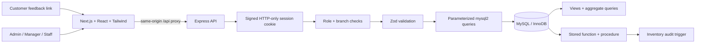

# System architecture

The frontend never receives database credentials. Next.js proxies `/api` to the loopback Express server, avoiding an extra cross-origin setup. Express validates JSON, checks the session against the current employee record, and verifies role and branch authorization.

The API stores session cookies with HttpOnly and SameSite=Strict; production adds Secure and therefore requires HTTPS. State-changing endpoints require JSON. Browser Origin must match APP_ORIGIN. Login attempts are rate-limited. A receipt token has a separate JWT audience from session tokens, so it cannot authenticate as an employee.

Responsibilities are deliberately simple:

- `backend/src/db.js`: connection pool, parameterized query helper, transaction boundary.
- `auth.js`: sessions, receipt tokens, role and branch checks.
- `orders.js`: order creation, details, checkout, cancellation, staff-recorded feedback.
- `management.js`: validated catalogue edits, employees, recipes, stock, availability, supplier quotes.
- `analytics.js`: scoped report queries.
- `feedback.js`: public order-specific feedback.
- `app.js`: middleware, routing and consistent errors.
- `frontend/app/page.js`: login, navigation and shared workspace state.
- `frontend/components/`: separate dashboard, orders, inventory, reports, catalogue and recipe components so teammates can work independently.
- `frontend/app/feedback/page.js`: customer receipt form.

No microservices, message queue, ORM, payment gateway, or extra hosting platform is needed for this college project. The setup account owns its schema for teaching; a real deployment should separate migration credentials from the runtime database account.
