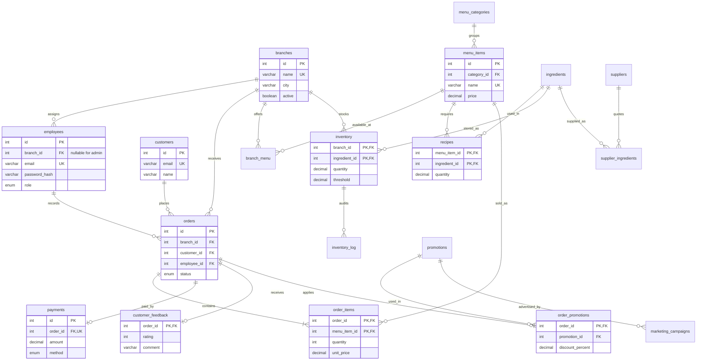

# TableTrail ER diagram

GitHub renders this Mermaid diagram. Primary and foreign keys are detailed in [database-design.md](../architecture/database-design.md); the executable schema is [schema.sql](../../database/schema.sql).

Employee branch assignment is optional for admins, mandatory for managers/staff. The diagram shows the common assigned-employee case. Every API-created order contains at least one item; SQL foreign keys alone cannot enforce that minimum cardinality, so API validation and checkout enforce it.
